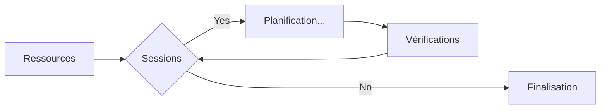
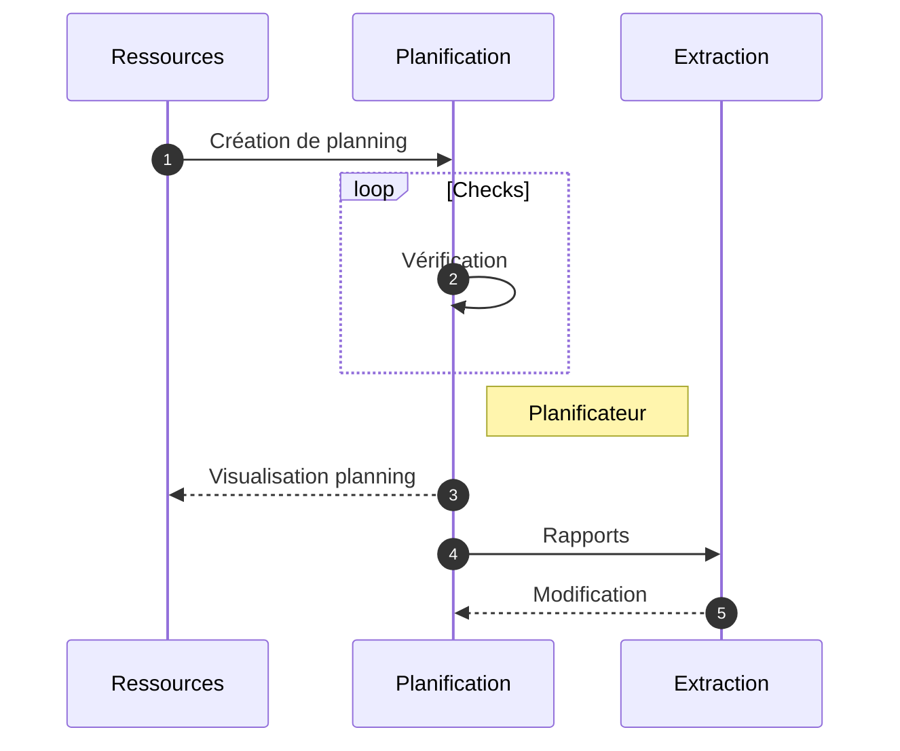

---
tags:
  - HTML5
  - JavaScript
  - CSS
---

# Planification automatique

## Flowcharts

```mermaid
graph LR
  A[Ressources] --> B{Sessions};
  B -->|Yes| C[Planification...];
  C --> D[Vérifications];
  D --> B;
  B ---->|No| E[Finalisation];
```

## Sequence Diagrams

```mermaid
sequenceDiagram
  autonumber
  Ressources->>Planification: Création de planning
  loop Checks
      Planification->>Planification: Vérification
  end
  Note right of Planification: Planificateur
  Planification-->>Ressources: Visualisation planning
  Planification->>Extraction: Rapports
  Extraction-->>Planification: Modification
```